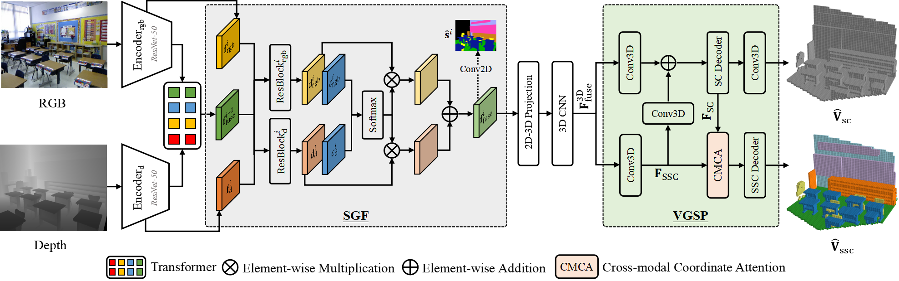

# 2D Semantic-guided Semantic Scene Completion
<p align="center"> 

</p>

## Introduction

This repository contains the source code for the paper 2D Semantic-guided Semantic Scene Completion

## Changelog 🔥

- [2024/07/16] The models and code are released.
- [2024/04/15] The repo is created.

## Installation 📥

Moreover, this repository introduces an integrated Semantic Scene Completion Benchmark implemented in Python 3.8, PyTorch 1.12 and CUDA 11.3. 

1. You can use the following command to install PyTorch with CUDA 11.3. 
```
conda create -n ssc python=3.8
conda activate ssc
conda install pytorch==1.12.1 torchvision==0.13.1 torchaudio==0.12.1 cudatoolkit=11.3 -c pytorch
```

2. Install dependencies:
```
- imageio 2.19.1
- Pillow 9.1.0
- scikit-image 0.19.3
- scikit-learn 0.24.2
- scipy 1.7.0
- tensorboard 2.10.0
- tqdm 4.51.0
- pandas 1.3.0
- timm 0.6.11
- torchvision 0.13.1
- h5py 3.3.0
- opencv-python 4.8.0.76
- matplotlib 3.4.2
- PyYAML 5.4.1
```

3. Compile the CUDA code for data preparation
``` 
cd src
nvcc --ptxas-options=-v --compiler-options '-fPIC' -o lib_preproc.so --shared lib_preproc.cu
```

## Datasets and Pretrained Models 🛢️

The datasets are available at [GoogleEarth](https://drive.google.com/drive/folders/1Oc1s6fhosjmmsjTyLUtYztJN7V5GudKW?usp=sharing)
+ Please download the Datasets to the folder `data`.
+ If you need to modify the data path, please modify the configuration in `paths.conf`.

The pretrained models are available as below.
+ [NYU](https://drive.google.com/drive/folders/1HKGPzniCtPYJL4RMMbBi1XcQYM45m6ue?usp=sharing)
+ [NYUCAD](https://drive.google.com/drive/folders/1LOE-FZdvyRQwAKLoNz0lgSaRmnm8_MeH?usp=sharing)
+ [SemanticKITTI](https://drive.google.com/drive/folders/1mSxRUNJe9XK9TFx9TesHSkWE2cp4hgFn?usp=sharing)

## Inference 🚩

We provide an example to use our code.
1. Please download the pretrained models to the folder `weights`.

2. Use the `feature_preprocess.py` script to preprocess the desired datasets. Example: 
``` 
python feature_preprocess.py --dataset NYUCAD --weights NYUCAD_FF
```

3. Use the `eval_ssc.py` script for calculating metrics. Example:
``` 
python eval_ssc.py --dataset NYUCAD --weights NYUCAD_SSC
```

## Training 👩🏽‍💻

1. Use the `train_feature_fusion.py` script to pre-train the feature fusion of the desired dataset. Example: 
``` 
python train_feature_fusion.py --dataset NYUCAD --batch_size 4
```
Then, use the `feature_preprocess.py` script to preprocess the desired datasets. 

2. Use the `train_ssc.py` script to train the desired dataset. Example:
``` 
python train_ssc.py --dataset NYUCAD --batch_size 4
```

## [License]
This project is licensed under MIT License.
